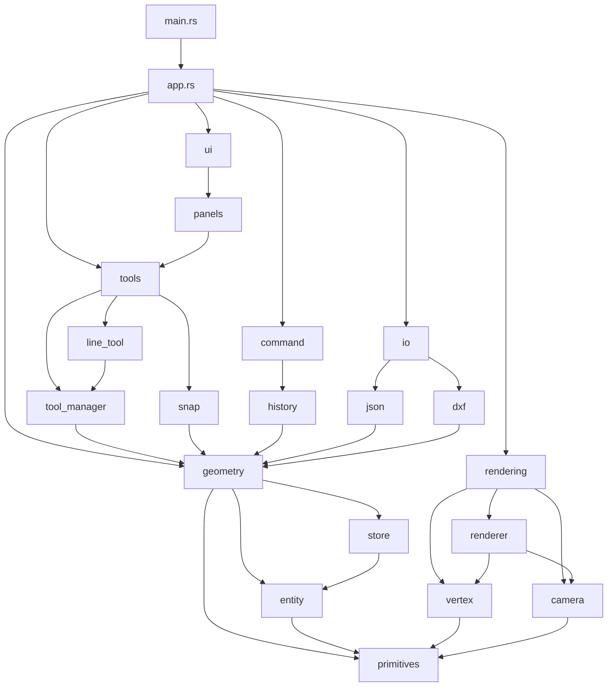

# CAD Implementation Roadmap: From Design to Working Software

> **対象**: ドキュメントを読んで実際にCADを作る開発者
> 
> **目的**: 設計から実装への具体的なステップ、ファイル階層、実装順序を明確化

---

## 📚 Table of Contents
1. [Current Status: What We Have](#1-current-status-what-we-have)
2. [Implementation Phases](#2-implementation-phases)
3. [File Hierarchy](#3-file-hierarchy)
4. [Implementation Order](#4-implementation-order)
5. [Dependency Graph](#5-dependency-graph)
6. [Verification Checklist](#6-verification-checklist)

---

## 1. Current Status: What We Have

### ✅ 設計図（完成）
- [x] アーキテクチャ設計 (CAD_ARCHITECTURES.md)
- [x] 実装詳細 (IMPLEMENTATION_DETAILS.md)
- [x] 全コマンド仕様 (DRAWING_COMMANDS.md)
- [x] イベント処理パターン (CAD_EVENT_HANDLING.md)
- [x] データ構造 (CAD_DATA_STRUCTURES.md)
- [x] UI実装 (UI_IMPLEMENTATION.md)
- [x] 性能最適化 (EXTREME_PERFORMANCE.md)

### ❌ 施工図（不足）
- [ ] ファイル階層の決定
- [ ] 実装順序の明確化
- [ ] 依存関係グラフ
- [ ] モジュール間インターフェース
- [ ] 具体的な実装ステップ

---

## 2. Implementation Phases

### Phase 0: プロジェクト初期化 (1日)

#### 目標
最小限の動作確認（黒い画面に白い十字線）

#### タスク
```bash
# 1. プロジェクト作成
cargo new my-cad
cd my-cad

# 2. 依存関係追加 (Cargo.toml)
# 3. ディレクトリ構造作成
# 4. main.rs 実装
# 5. 動作確認
cargo run
```

#### 成果物
- ✅ ウィンドウが開く
- ✅ 黒い背景
- ✅ 白い十字線が表示される

---

### Phase 1: Core Foundation (3-5日)

#### 目標
基本データ構造とレンダリングパイプライン

#### タスク
1. **データ構造** (1日)
   - [ ] `geometry/primitives.rs` - Point, Line, Circle
   - [ ] `geometry/entity.rs` - Entity enum
   - [ ] `geometry/store.rs` - GeometryStore (slotmap)

2. **レンダリング** (2日)
   - [ ] `rendering/renderer.rs` - wgpu 初期化
   - [ ] `rendering/camera.rs` - 2D カメラ (pan, zoom)
   - [ ] `rendering/shaders/basic.wgsl` - シェーダー

3. **アプリケーション** (1日)
   - [ ] `app.rs` - AppState
   - [ ] `main.rs` - イベントループ

#### 成果物
- ✅ Line, Circle を描画できる
- ✅ カメラでパン・ズームできる

---

### Phase 2: Tool System (3-5日)

#### 目標
基本的な作図ツール

#### タスク
1. **Tool Trait** (1日)
   - [ ] `tools/mod.rs` - Tool trait
   - [ ] `tools/tool_manager.rs` - ToolManager

2. **基本ツール** (2-3日)
   - [ ] `tools/line_tool.rs` - LineTool
   - [ ] `tools/circle_tool.rs` - CircleTool
   - [ ] `tools/select_tool.rs` - SelectTool

3. **スナップシステム** (1日)
   - [ ] `tools/snap.rs` - SnapSystem

#### 成果物
- ✅ マウスで線を引ける
- ✅ 円を描ける
- ✅ エンドポイントスナップが効く

---

### Phase 3: UI Integration (3-5日)

#### 目標
egui UI の統合

#### タスク
1. **egui 統合** (2日)
   - [ ] `ui/mod.rs` - egui 初期化
   - [ ] `ui/panels.rs` - ToolPalette, PropertyPanel

2. **レンダリング統合** (1日)
   - [ ] CAD viewport + egui UI

3. **イベント処理** (1日)
   - [ ] マウスイベントの優先順位
   - [ ] UI vs CAD ツール

#### 成果物
- ✅ ツールパレットが表示される
- ✅ ツールを切り替えられる
- ✅ プロパティパネルが動作する

---

### Phase 4: File I/O (2-3日)

#### 目標
保存・読み込み機能

#### タスク
1. **Serialization** (1日)
   - [ ] `io/mod.rs` - FileFormat trait
   - [ ] `io/json.rs` - JSON 形式

2. **File Operations** (1日)
   - [ ] Save / Load
   - [ ] Recent files

3. **Export** (1日)
   - [ ] `io/dxf.rs` - DXF エクスポート
   - [ ] `io/svg.rs` - SVG エクスポート

#### 成果物
- ✅ ファイルを保存できる
- ✅ ファイルを開ける
- ✅ DXF/SVG にエクスポートできる

---

### Phase 5: Advanced Features (5-7日)

#### 目標
高度な機能

#### タスク
1. **Undo/Redo** (2日)
   - [ ] `command/mod.rs` - Command trait
   - [ ] `command/history.rs` - CommandHistory

2. **レイヤー** (1日)
   - [ ] `layer/mod.rs` - Layer, LayerManager

3. **高度なツール** (2-3日)
   - [ ] Offset, Trim, Extend
   - [ ] Fillet, Mirror, Array

4. **選択システム** (1日)
   - [ ] Window/Crossing Selection

#### 成果物
- ✅ Undo/Redo が動作する
- ✅ レイヤーを管理できる
- ✅ 高度な編集ができる

---

## 3. File Hierarchy

### 完全なディレクトリ構造

```
my-cad/
├── Cargo.toml
├── Cargo.lock
├── README.md
├── .gitignore
│
├── src/
│   ├── main.rs                 # エントリーポイント
│   ├── app.rs                  # アプリケーション状態
│   │
│   ├── geometry/               # 幾何データ
│   │   ├── mod.rs
│   │   ├── primitives.rs       # Point, Vector2
│   │   ├── entity.rs           # Entity enum
│   │   └── store.rs            # GeometryStore
│   │
│   ├── rendering/              # レンダリング
│   │   ├── mod.rs
│   │   ├── renderer.rs         # Renderer
│   │   ├── camera.rs           # Camera2D
│   │   ├── vertex.rs           # Vertex
│   │   └── shaders/
│   │       └── basic.wgsl      # シェーダー
│   │
│   ├── tools/                  # ツールシステム
│   │   ├── mod.rs
│   │   ├── tool_manager.rs     # ToolManager
│   │   ├── snap.rs             # SnapSystem
│   │   ├── line_tool.rs        # LineTool
│   │   ├── circle_tool.rs      # CircleTool
│   │   ├── select_tool.rs      # SelectTool
│   │   ├── offset_tool.rs      # OffsetTool
│   │   └── ...
│   │
│   ├── ui/                     # UI
│   │   ├── mod.rs
│   │   ├── panels.rs           # ToolPalette, PropertyPanel
│   │   └── theme.rs            # UI テーマ
│   │
│   ├── command/                # Undo/Redo
│   │   ├── mod.rs
│   │   ├── history.rs          # CommandHistory
│   │   └── commands.rs         # 各種コマンド
│   │
│   ├── io/                     # ファイル I/O
│   │   ├── mod.rs
│   │   ├── json.rs             # JSON 形式
│   │   ├── binary.rs           # Binary 形式
│   │   ├── dxf.rs              # DXF エクスポート
│   │   └── svg.rs              # SVG エクスポート
│   │
│   ├── layer/                  # レイヤー管理
│   │   ├── mod.rs
│   │   └── manager.rs          # LayerManager
│   │
│   └── util/                   # ユーティリティ
│       ├── mod.rs
│       ├── math.rs             # 数学関数
│       └── color.rs            # Color
│
├── assets/                     # アセット
│   └── shaders/
│       └── basic.wgsl
│
├── tests/                      # テスト
│   ├── integration_test.rs
│   └── ...
│
└── docs/                       # ドキュメント
    ├── architecture.md
    └── ...
```

---

## 4. Implementation Order

### 依存関係に基づく実装順序

```
Phase 0: Project Setup
  └─> Cargo.toml, main.rs

Phase 1: Core Foundation
  ├─> geometry/primitives.rs    (依存なし)
  ├─> geometry/entity.rs         (primitives に依存)
  ├─> geometry/store.rs          (entity に依存)
  ├─> rendering/vertex.rs        (primitives に依存)
  ├─> rendering/camera.rs        (primitives に依存)
  ├─> rendering/renderer.rs      (vertex, camera に依存)
  └─> app.rs                     (全てに依存)

Phase 2: Tool System
  ├─> tools/mod.rs               (geometry に依存)
  ├─> tools/snap.rs              (geometry に依存)
  ├─> tools/tool_manager.rs      (mod に依存)
  ├─> tools/line_tool.rs         (tool_manager に依存)
  ├─> tools/circle_tool.rs       (tool_manager に依存)
  └─> tools/select_tool.rs       (tool_manager に依存)

Phase 3: UI Integration
  ├─> ui/mod.rs                  (app に依存)
  ├─> ui/panels.rs               (tools に依存)
  └─> main.rs (更新)             (ui に依存)

Phase 4: File I/O
  ├─> io/mod.rs                  (geometry に依存)
  ├─> io/json.rs                 (mod に依存)
  ├─> io/dxf.rs                  (mod に依存)
  └─> io/svg.rs                  (mod に依存)

Phase 5: Advanced Features
  ├─> command/mod.rs             (geometry に依存)
  ├─> command/history.rs         (mod に依存)
  ├─> layer/mod.rs               (geometry に依存)
  └─> tools/advanced/            (全てに依存)
```

---

## 5. Dependency Graph

### モジュール依存関係図



---

## 6. Verification Checklist

### Phase 0: プロジェクト初期化

- [ ] `cargo run` でウィンドウが開く
- [ ] 黒い背景が表示される
- [ ] 白い十字線が表示される
- [ ] ウィンドウをリサイズできる
- [ ] ESC で終了できる

### Phase 1: Core Foundation

- [ ] `GeometryStore` に Line を追加できる
- [ ] `GeometryStore` に Circle を追加できる
- [ ] Line が画面に描画される
- [ ] Circle が画面に描画される
- [ ] カメラでパンできる (中ボタンドラッグ)
- [ ] カメラでズームできる (スクロールホイール)

### Phase 2: Tool System

- [ ] LineTool でマウスクリックで線を引ける
- [ ] CircleTool で円を描ける
- [ ] プレビューが表示される
- [ ] ESC でツールをキャンセルできる
- [ ] エンドポイントスナップが効く
- [ ] 中点スナップが効く

### Phase 3: UI Integration

- [ ] ツールパレットが表示される
- [ ] ツールを切り替えられる
- [ ] プロパティパネルが表示される
- [ ] UI をクリックしても CAD ツールが反応しない
- [ ] CAD ビューポートをクリックするとツールが反応する

### Phase 4: File I/O

- [ ] ファイルを保存できる (.json)
- [ ] ファイルを開ける
- [ ] 保存したファイルを開くと元の図面が復元される
- [ ] DXF にエクスポートできる
- [ ] AutoCAD で DXF を開ける

### Phase 5: Advanced Features

- [ ] Undo (Ctrl+Z) が動作する
- [ ] Redo (Ctrl+Y) が動作する
- [ ] レイヤーを追加できる
- [ ] レイヤーを切り替えられる
- [ ] Offset ツールが動作する
- [ ] Trim ツールが動作する
- [ ] Window Selection が動作する
- [ ] Crossing Selection が動作する

---

## 7. Quick Start Guide

### 最速で動かす手順

```bash
# 1. プロジェクト作成
cargo new my-cad
cd my-cad

# 2. Cargo.toml をコピー
# (GETTING_STARTED.md から)

# 3. ディレクトリ作成
mkdir -p src/{geometry,rendering,tools,ui,command,io,layer,util}
mkdir -p assets/shaders

# 4. 基本ファイルをコピー
# main.rs, app.rs, geometry/primitives.rs, ...
# (GETTING_STARTED.md から)

# 5. シェーダーをコピー
# assets/shaders/basic.wgsl

# 6. 実行
cargo run
```

---

## 8. Common Pitfalls (よくある失敗)

### ❌ 失敗パターン

1. **いきなり全機能を実装**
   - → Phase ごとに進める

2. **依存関係を無視**
   - → 依存グラフに従う

3. **テストなしで進める**
   - → 各 Phase で動作確認

4. **ファイル構造が不明確**
   - → 最初に階層を決める

5. **wgpu の初期化で詰まる**
   - → GETTING_STARTED.md の完全なコードをコピー

### ✅ 成功パターン

1. **Phase 0 を完璧に**
   - 十字線が表示されるまで次に進まない

2. **1つずつ確認**
   - 各機能を実装したら必ず動作確認

3. **既存コードを参照**
   - src/ の実装を見る

4. **ドキュメントを活用**
   - 詰まったら該当ドキュメントを読む

---

## 📊 実装時間見積もり

| Phase | 内容 | 時間 | 累計 |
|-------|------|------|------|
| Phase 0 | プロジェクト初期化 | 1日 | 1日 |
| Phase 1 | Core Foundation | 3-5日 | 4-6日 |
| Phase 2 | Tool System | 3-5日 | 7-11日 |
| Phase 3 | UI Integration | 3-5日 | 10-16日 |
| Phase 4 | File I/O | 2-3日 | 12-19日 |
| Phase 5 | Advanced Features | 5-7日 | 17-26日 |
| **合計** | **MVP完成** | **17-26日** | **3-5週間** |

---

## 🎯 Next Steps

### 今すぐ始める

1. ✅ このドキュメントを読む
2. ✅ `GETTING_STARTED.md` を開く
3. ✅ Phase 0 を実行
4. ✅ 十字線が表示されることを確認
5. ✅ Phase 1 に進む

### 困ったら

1. 該当する Phase のドキュメントを読む
2. `docs/` の関連ドキュメントを参照
3. 既存の `src/` コードを見る
4. Verification Checklist で確認

---

*Created by Rust CAD Framework Team*
*Last Updated: 2025-11-26*
